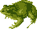

# Image pixelator
## Introduction
My university project on image processing. Color quantization for japan crosswords making. <br/> C++, OpenCV, Cmake is used.
## Breef Description
This program creates small pixel image with a given number of colors from any jpg picture with one color object on white background. 
#### Example<br/>
Source image:<br/>
<br/>
Params: Height - 50 Color number - 4<br/>
Result image:<br/>

## Requirements
C++17
Cmake 3.8
OpenCV 3.4
##Getting Started
####To build the project you should clone git to any repo using 
```
$ git clone https://github.com/oldbigboss/pixelator_course_project.git
```
## Description
This program will crop the image without leaving white columns or rows. It applies color dimension reduction (color quantization) and background threshold filtering.
The resulting file is shown and writed in a folder with bins. The filename is Pixelated.PNG
